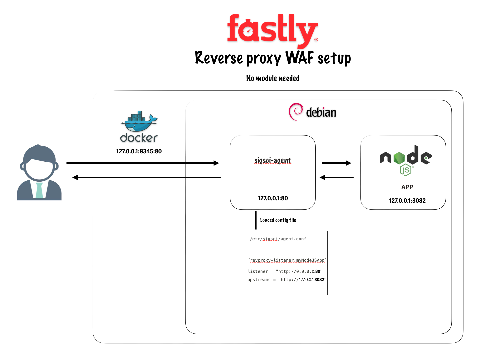

# Fastly WAF reverse proxy mode demo 

The Next-Gen WAF agent can be configured to run as a reverse proxy. In reverse proxy mode, the agent interacts directly with requests and responses without the need for a module. 

Running the agent in reverse proxy mode is ideal when a module for your web service does not yet exist or you do not want to modify your web service configuration (e.g., while testing the product). In this mode, the agent sits inline as a service in front of your web service.

## Diagram of my demo




# How to use 

This `Makefile` provides a set of commands for building, running, and managing a Docker container for the `debian-sigsci-agent` image. Below is an explanation of the main commands and their functionalities.

## Variables
- **IMAGE_NAME**: Name of the Docker image to be built (`debian-sigsci-agent`).
- **CONTAINER_NAME**: Name of the Docker container to be created (`debian-sigsci-agent-container`).
- **PORT**: Port number to be used for the container (`8345`).
- **HOST_WWW_DIR**: Directory on the host machine to be mounted as a volume in the container (`$(PWD)/www`).
- **ACCESS_KEY_ID**: Access key ID for environment variable (`qssqs-sd-sddsa-dd`).
- **SECRET_ACCESS_KEY**: Secret access key for environment variable (`sqdqdsqdsqs-OplWZe1IBew999SJDScIGc`).

## Commands

### Default Target
- **all**: Default target that runs both `build` and `run` commands sequentially.

### Build Commands
- **build**: Builds the Docker image using the Dockerfile in the current directory.
  ```sh
  make build
  ```
- **build-no-cache**: Builds the Docker image without using the cache.
  ```sh
  make build-no-cache
  ```

### Container Management Commands
- **run**: Runs the Docker container with the specified environment variables, port, and volume mount.
  ```sh
  make run
  ```
- **start**: Starts the Docker container if it is stopped.
  ```sh
  make start
  ```
- **stop**: Stops the Docker container if it is running.
  ```sh
  make stop
  ```
- **rm**: Removes the Docker container.
  ```sh
  make rm
  ```
- **clean**: Stops and removes the Docker container.
  ```sh
  make clean
  ```

### Image Management Command
- **rmi**: Removes the Docker image.
  ```sh
  make rmi
  ```

### Utility Commands
- **logs**: Views the logs from the Docker container.
  ```sh
  make logs
  ```
- **shell**: Opens a shell into the running Docker container.
  ```sh
  make shell
  ```
- **images**: Lists all Docker images on the host machine.
  ```sh
  make images
  ```
- **ps**: Lists all Docker containers on the host machine.
  ```sh
  make ps
  ```

Use these commands to efficiently manage your Docker images and containers.